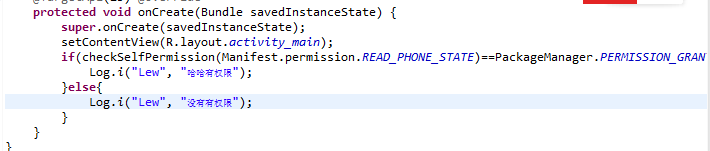

> 原创

**一个小测试关于6.0权限**

**提问：**6.0既然提供了权限代码，为何还要用v4兼容包？（万能包，每次安卓sdk更新都会对应更新，这也是谷歌的一种更新策略，为了兼容旧版本）直接把编译环境改成6.0不就好了？

**过程：**为此专门做了个demo测试：6.0编译环境，target先不说，因为没有质的影响（后面解释），代码如下，运行在6.0设备正常，而以下报错,没有该方法：

**日志：**

**代码：**

**思考：**后来想想终于明白了，因为编译环境决定的Android.jar在打包运行时并不会进入，而设备本身的系统版本决定了该jar（当然我没有学习过开发安卓系统，不知道Rom里都有什么，但我猜测一定有个对应的android.jar文件），所以编译时没错，运行时因为设备没有包含权限的jar，所以自然找不到出错。

**总结：**兼容性从两个角度，我们常说的是向下兼容，指搭载高安卓版本系统的机子可以运行低版本应用。知道为什么？不妨我们从向上兼容这个相反角度看，就是说低版本编译能过的项目，一定能在高版本系统设备运行。这样看是不是不难理解了，比如4.4只要能编译过，肯定在6.0设备运行没问题。6.0编译过，4.4设备运行就不一定能过。（通常设备版本不低于编译环境版本，否则就需要引入兼容包！，所以编译环境通常不建议很高）

**测试结果：**

最后补充说下测试结果：①低于6.0的设备无法运行；②6.0设备（target=23，打印日志没有权限；低于23则打印有权限），就是说，只有target=23才走新权限路线，否则checkpermission始终是返回了true。（注意在manefist中配置权限）

注：哪里写的有问题还请指出共同学习

By luying